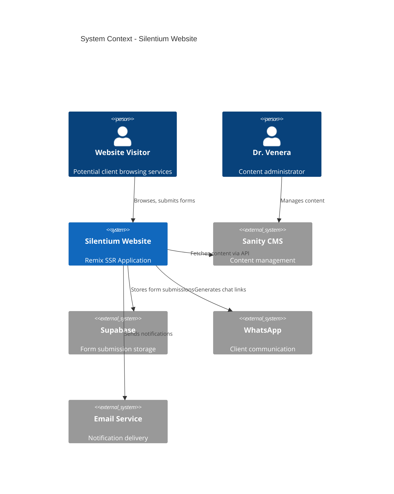
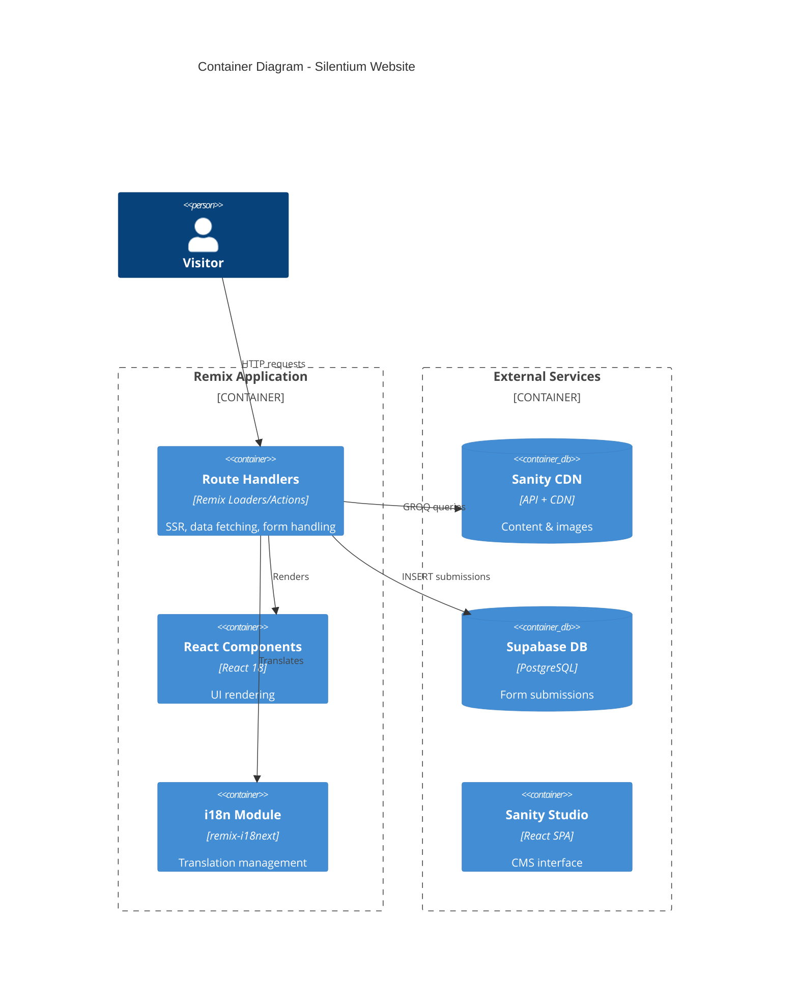
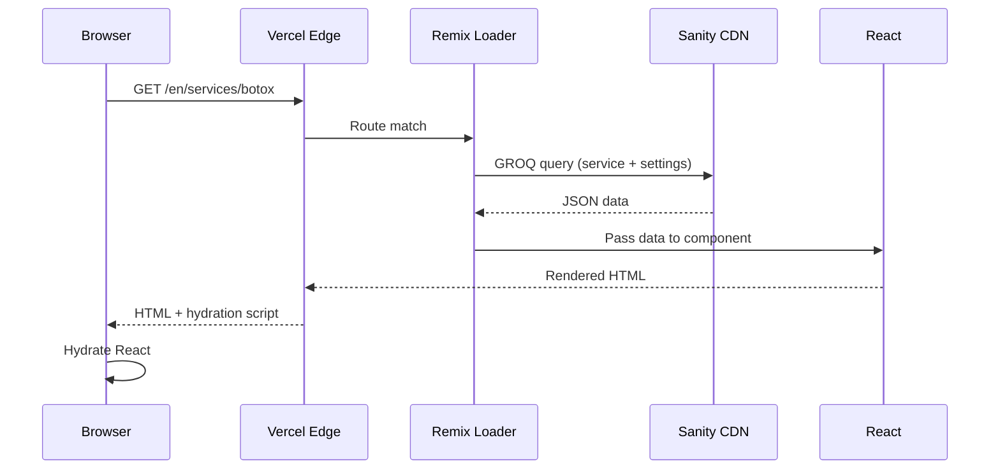
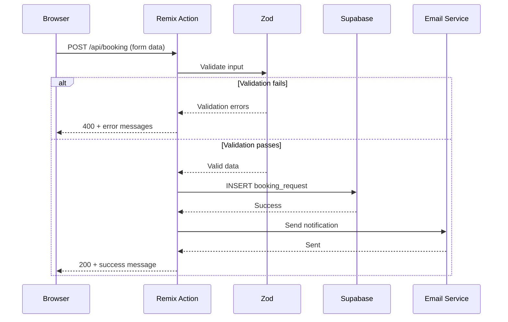
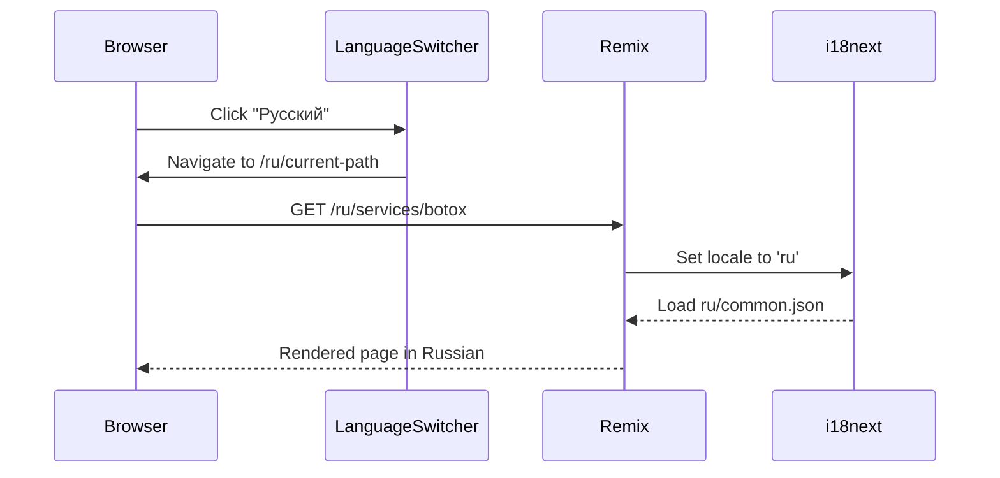

# Venera Cosmetology / Silentium - Architecture Document

## Introduction / Preamble

This document outlines the overall system architecture for the Silentium website, including the Remix application structure, Sanity CMS integration, Supabase database setup, and deployment strategy. It serves as the authoritative technical blueprint for AI-driven development, ensuring consistency and adherence to chosen patterns and technologies.

**Relationship to Frontend Architecture:**
A separate Frontend Architecture Document (`frontend-architecture.md`) details the frontend-specific design including React component architecture, styling approach, and state management. It must be used in conjunction with this document. Core technology stack choices documented herein are definitive for the entire project.

---

## Table of Contents

1. Technical Summary
2. High-Level Overview
3. Architectural / Design Patterns Adopted
4. Component View
5. Project Structure
6. API Reference
7. Data Models
8. Core Workflow / Sequence Diagrams
9. Definitive Tech Stack Selections
10. Infrastructure and Deployment Overview
11. Error Handling Strategy
12. Coding Standards
13. Overall Testing Strategy
14. Security Best Practices
15. Key Reference Documents
16. Change Log

---

## Technical Summary

The Silentium website is a server-side rendered marketing and lead capture application built with Remix (React Router v7) as the full-stack framework. Content is managed through Sanity, a headless CMS, while form submissions are stored in Supabase (PostgreSQL). The application supports three languages (English, Russian, Indonesian) via remix-i18next.

Key architectural characteristics:
- **Monolithic SSR Application**: Single Remix app handling routing, data fetching, and rendering
- **Headless CMS Integration**: Sanity provides content via GROQ queries at request time
- **Serverless Deployment**: Vercel handles hosting, edge caching, and serverless functions
- **Progressive Enhancement**: Forms work without JavaScript; enhancements layered on top

The architecture prioritizes SEO performance, content flexibility, and developer experience while staying within free/low-cost service tiers.

---

## High-Level Overview

### Architectural Style
**Monolithic Server-Side Rendered Application** with headless CMS and external database for transactional data.

### Repository Structure
**Monorepo** containing:
- Remix application (`/app`)
- Sanity Studio (`/sanity`)
- Shared TypeScript types (`/shared`)
- Documentation (`/venera_docs`)

### System Context Diagram



### Container Diagram



---

## Architectural / Design Patterns Adopted

- **Server-Side Rendering (SSR)**: All pages rendered on server for SEO and performance; Remix handles hydration
- **Headless CMS Pattern**: Content decoupled from presentation; Sanity provides data via API
- **Repository Pattern**: Data access abstracted through service modules (e.g., `sanity.server.ts`, `supabase.server.ts`)
- **Progressive Enhancement**: Core functionality works without JavaScript; JS enhances UX
- **Feature-Based Organization**: Code organized by feature/domain rather than technical layer
- **Colocation**: Tests, styles, and components kept together where practical

---

## Component View

### Remix Application (`/app`)

The Remix app handles all user-facing functionality:

```mermaid
graph TD
    subgraph Routes
        ROOT[root.tsx] --> LAYOUT[Layout Components]
        ROOT --> LANG[/:lang routes]
        LANG --> HOME[/$lang._index]
        LANG --> ABOUT[/$lang.about]
        LANG --> SERVICES[/$lang.services._index]
        LANG --> SERVICE_DETAIL[/$lang.services.$slug]
        LANG --> CONTACT[/$lang.contact]
    end

    subgraph Services
        SANITY[sanity.server.ts]
        SUPABASE[supabase.server.ts]
        I18N[i18n.server.ts]
    end

    subgraph Components
        HEADER[Header]
        FOOTER[Footer]
        HERO[HeroSection]
        SERVICE_CARD[ServiceCard]
        FORMS[ContactForm, BookingForm]
    end

    LAYOUT --> HEADER
    LAYOUT --> FOOTER
    HOME --> HERO
    HOME --> SERVICE_CARD
    SERVICES --> SERVICE_CARD
    CONTACT --> FORMS

    ROOT -.-> SANITY
    ROOT -.-> SUPABASE
    ROOT -.-> I18N
```

### Sanity Studio (`/sanity`)

Standalone CMS interface for content management:
- Schema definitions for all content types
- Custom input components for multilingual fields
- Preview configurations for draft content

### External Services

| Service | Purpose | Integration Point |
|---------|---------|-------------------|
| Sanity | Content storage and delivery | Remix loaders via GROQ |
| Supabase | Form submission storage | Remix actions via Supabase JS client |
| Vercel | Hosting and edge functions | Deployment target |
| SendGrid/Resend | Email notifications | Supabase Edge Functions or Remix actions |

---

## Project Structure

```plaintext
venera-cosmetology/
├── .github/
│   └── workflows/
│       └── ci.yml                    # CI/CD pipeline
├── app/                              # Remix application
│   ├── components/
│   │   ├── layout/
│   │   │   ├── Header.tsx
│   │   │   ├── Footer.tsx
│   │   │   ├── MobileMenu.tsx
│   │   │   └── LanguageSwitcher.tsx
│   │   ├── sections/
│   │   │   ├── HeroSection.tsx
│   │   │   ├── ServicesPreview.tsx
│   │   │   ├── AboutPreview.tsx
│   │   │   └── ContactCTA.tsx
│   │   ├── services/
│   │   │   ├── ServiceCard.tsx
│   │   │   ├── ServiceGallery.tsx
│   │   │   └── ServiceDetail.tsx
│   │   ├── forms/
│   │   │   ├── ContactForm.tsx
│   │   │   ├── BookingForm.tsx
│   │   │   └── FormField.tsx
│   │   └── ui/
│   │       ├── Button.tsx
│   │       ├── Card.tsx
│   │       ├── Input.tsx
│   │       ├── Select.tsx
│   │       ├── Toast.tsx
│   │       └── index.ts
│   ├── hooks/
│   │   ├── useScrollReveal.ts
│   │   └── useMediaQuery.ts
│   ├── lib/
│   │   ├── sanity.server.ts          # Sanity client and queries
│   │   ├── supabase.server.ts        # Supabase client
│   │   ├── i18n.server.ts            # i18n configuration
│   │   ├── email.server.ts           # Email notification service
│   │   └── utils.ts                  # Shared utilities
│   ├── routes/
│   │   ├── _index.tsx                # Redirect to default language
│   │   ├── $lang._index.tsx          # Homepage
│   │   ├── $lang.about.tsx           # About page
│   │   ├── $lang.services._index.tsx # Services index
│   │   ├── $lang.services.$slug.tsx  # Service detail
│   │   ├── $lang.contact.tsx         # Contact page
│   │   ├── $lang.privacy.tsx         # Privacy policy
│   │   ├── $lang.terms.tsx           # Terms of service
│   │   ├── api.contact.tsx           # Contact form action
│   │   ├── api.booking.tsx           # Booking form action
│   │   └── sitemap[.]xml.tsx         # Dynamic sitemap
│   ├── styles/
│   │   ├── tailwind.css              # Tailwind entry point
│   │   └── fonts.css                 # Custom font definitions
│   ├── types/
│   │   └── index.ts                  # Shared TypeScript types
│   ├── entry.client.tsx
│   ├── entry.server.tsx
│   └── root.tsx
├── public/
│   ├── fonts/                        # Custom fonts
│   ├── images/                       # Static images
│   └── locales/                      # Translation files
│       ├── en/
│       │   └── common.json
│       ├── ru/
│       │   └── common.json
│       └── id/
│           └── common.json
├── sanity/                           # Sanity Studio
│   ├── schemas/
│   │   ├── documents/
│   │   │   ├── siteSettings.ts
│   │   │   ├── page.ts
│   │   │   ├── service.ts
│   │   │   └── testimonial.ts
│   │   ├── objects/
│   │   │   ├── localizedString.ts
│   │   │   ├── localizedText.ts
│   │   │   └── portableText.ts
│   │   └── index.ts
│   ├── lib/
│   │   └── client.ts
│   └── sanity.config.ts
├── shared/                           # Shared code
│   └── types/
│       ├── sanity.ts                 # Sanity document types
│       └── forms.ts                  # Form submission types
├── test/
│   ├── unit/
│   ├── integration/
│   └── e2e/
├── venera_docs/                      # Project documentation
├── .env.example
├── .eslintrc.cjs
├── .prettierrc
├── package.json
├── remix.config.js
├── tailwind.config.ts
├── tsconfig.json
└── README.md
```

### Key Directory Descriptions

- **app/components/**: React components organized by domain (layout, sections, services, forms, ui)
- **app/lib/**: Server-only modules for external service integration
- **app/routes/**: Remix route modules with loaders and actions
- **public/locales/**: Translation JSON files for each language
- **sanity/schemas/**: Sanity content type definitions
- **shared/types/**: TypeScript types shared between app and sanity

---

## API Reference

### External APIs Consumed

#### Sanity Content API

- **Purpose:** Fetch all content (services, about, site settings, testimonials)
- **Base URL:**
  - Production: `https://{projectId}.api.sanity.io/v2023-12-01/data/query/production`
  - Preview: `https://{projectId}.api.sanity.io/v2023-12-01/data/query/drafts`
- **Authentication:** Bearer token (for authenticated/preview requests) or public for published content
- **Key Queries Used:**

```groq
// Get all services
*[_type == "service"] | order(category asc, order asc) {
  _id,
  slug,
  category,
  "title": title[$lang],
  "shortDescription": shortDescription[$lang],
  "image": image.asset->url
}

// Get single service by slug
*[_type == "service" && slug.current == $slug][0] {
  _id,
  slug,
  category,
  "title": title[$lang],
  "description": description[$lang],
  "benefits": benefits[][$lang],
  "image": image.asset->url,
  "relatedServices": relatedServices[]->{ slug, "title": title[$lang] }
}

// Get site settings
*[_type == "siteSettings"][0] {
  "heroTitle": heroTitle[$lang],
  "heroSubtitle": heroSubtitle[$lang],
  "heroImage": heroImage.asset->url,
  contactEmail,
  contactPhone,
  socialLinks
}
```

#### Supabase Database API

- **Purpose:** Store form submissions (contacts, booking requests)
- **Base URL:** `https://{projectRef}.supabase.co/rest/v1/`
- **Authentication:** Anon key (public, RLS enforced) or Service role key (server-side)
- **Key Operations:**
  - `POST /contact_submissions` - Insert contact form data
  - `POST /booking_requests` - Insert booking request data

### Internal APIs Provided

#### Contact Form Submission

- **Endpoint:** `POST /api/contact`
- **Purpose:** Process contact form submissions
- **Request Body:**
```typescript
interface ContactFormData {
  name: string;
  email: string;
  phone?: string;
  message: string;
  language: 'en' | 'ru' | 'id';
}
```
- **Success Response (200):**
```typescript
{ success: true, message: "Message sent successfully" }
```
- **Error Response (400/500):**
```typescript
{ success: false, error: string }
```

#### Booking Request Submission

- **Endpoint:** `POST /api/booking`
- **Purpose:** Process consultation booking requests
- **Request Body:**
```typescript
interface BookingFormData {
  name: string;
  email: string;
  phone: string;
  preferredService: string;
  preferredDateStart: string;
  preferredDateEnd: string;
  message?: string;
  language: 'en' | 'ru' | 'id';
}
```
- **Responses:** Same structure as contact form

---

## Data Models

### Core Application Entities

#### Service (Sanity Document)

```typescript
interface Service {
  _id: string;
  _type: 'service';
  slug: { current: string };
  category: 'anti-aging' | 'rejuvenation' | 'problem-specific' | 'specialized' | 'preparatory';
  order: number;
  title: LocalizedString;
  shortDescription: LocalizedString;
  description: LocalizedText;
  benefits: LocalizedString[];
  image: SanityImageAsset;
  relatedServices: Reference<Service>[];
}

interface LocalizedString {
  en: string;
  ru: string;
  id: string;
}

interface LocalizedText {
  en: PortableTextBlock[];
  ru: PortableTextBlock[];
  id: PortableTextBlock[];
}
```

#### Site Settings (Sanity Document)

```typescript
interface SiteSettings {
  _id: string;
  _type: 'siteSettings';
  heroTitle: LocalizedString;
  heroSubtitle: LocalizedString;
  heroImage: SanityImageAsset;
  aboutDrVenera: LocalizedText;
  aboutSilentium: LocalizedText;
  contactEmail: string;
  contactPhone: string;
  whatsappNumber: string;
  location: string;
  businessHours: string;
  socialLinks: {
    instagram?: string;
    facebook?: string;
    telegram?: string;
  };
}
```

### Database Schemas (Supabase)

#### contact_submissions

```sql
CREATE TABLE contact_submissions (
  id UUID PRIMARY KEY DEFAULT gen_random_uuid(),
  created_at TIMESTAMPTZ DEFAULT NOW(),
  name VARCHAR(255) NOT NULL,
  email VARCHAR(255) NOT NULL,
  phone VARCHAR(50),
  message TEXT NOT NULL,
  language VARCHAR(5) NOT NULL,
  status VARCHAR(20) DEFAULT 'new',
  notes TEXT
);

-- RLS Policy: Only insert allowed for anon, full access for authenticated
ALTER TABLE contact_submissions ENABLE ROW LEVEL SECURITY;

CREATE POLICY "Allow public inserts" ON contact_submissions
  FOR INSERT TO anon WITH CHECK (true);

CREATE POLICY "Allow authenticated full access" ON contact_submissions
  FOR ALL TO authenticated USING (true);
```

#### booking_requests

```sql
CREATE TABLE booking_requests (
  id UUID PRIMARY KEY DEFAULT gen_random_uuid(),
  created_at TIMESTAMPTZ DEFAULT NOW(),
  name VARCHAR(255) NOT NULL,
  email VARCHAR(255) NOT NULL,
  phone VARCHAR(50) NOT NULL,
  preferred_service VARCHAR(255) NOT NULL,
  preferred_date_start DATE,
  preferred_date_end DATE,
  message TEXT,
  language VARCHAR(5) NOT NULL,
  status VARCHAR(20) DEFAULT 'pending',
  notes TEXT
);

-- Same RLS policies as contact_submissions
```

---

## Core Workflow / Sequence Diagrams

### Page Load (Service Detail)



### Form Submission (Booking Request)



### Language Switching



---

## Definitive Tech Stack Selections

| Category | Technology | Version | Description / Purpose | Justification |
|----------|------------|---------|----------------------|---------------|
| **Languages** | TypeScript | 5.3.x | Primary language | Type safety, better DX |
| **Runtime** | Node.js | 20.x LTS | Server execution | Remix compatibility, LTS stability |
| **Framework** | Remix | 2.x (React Router 7) | Full-stack React | SSR, great DX, form handling |
| | React | 18.2.x | UI library | Industry standard, ecosystem |
| **Styling** | Tailwind CSS | 3.4.x | Utility CSS | Rapid development, consistency |
| **Animations** | Framer Motion | 11.x | Animation library | Declarative, React integration |
| **Forms** | React Hook Form | 7.x | Form state management | Performance, validation |
| | Zod | 3.x | Schema validation | Type-safe validation |
| **CMS** | Sanity | 3.x | Headless CMS | Free tier, flexible, GROQ |
| **Database** | Supabase | - | PostgreSQL + API | Free tier, real-time capable |
| **i18n** | remix-i18next | 6.x | Internationalization | Remix-native, SSR support |
| | i18next | 23.x | i18n core | Industry standard |
| **Deployment** | Vercel | - | Hosting platform | Remix-optimized, free tier |
| **Testing** | Vitest | 1.x | Unit testing | Fast, Vite-native |
| | Testing Library | 14.x | Component testing | React best practices |
| | Playwright | 1.x | E2E testing | Cross-browser, reliable |
| **Code Quality** | ESLint | 8.x | Linting | Code consistency |
| | Prettier | 3.x | Formatting | Auto-formatting |
| **Email** | Resend | - | Email API | Simple API, good DX |
| **Icons** | Lucide React | 0.x | Icon library | MIT, lightweight |

---

## Infrastructure and Deployment Overview

- **Cloud Provider:** Vercel (primary), Supabase (database), Sanity (CMS)
- **Core Services:**
  - Vercel Edge Network (CDN, SSR)
  - Vercel Serverless Functions (API routes)
  - Supabase PostgreSQL (form storage)
  - Sanity CDN (content delivery)
- **Infrastructure as Code:** Vercel project configuration via `vercel.json`
- **Deployment Strategy:** Git-based CI/CD via Vercel GitHub integration
- **Environments:**
  - Development: Local (`npm run dev`)
  - Preview: Vercel preview deployments (per PR)
  - Production: Vercel production (main branch)
- **Environment Promotion:** Automatic on merge to main after preview approval
- **Rollback Strategy:** Vercel instant rollback to previous deployment

### Environment Variables

```bash
# Sanity
SANITY_PROJECT_ID=
SANITY_DATASET=production
SANITY_API_TOKEN=           # For authenticated requests

# Supabase
SUPABASE_URL=
SUPABASE_ANON_KEY=
SUPABASE_SERVICE_ROLE_KEY=  # Server-side only

# Email (Resend)
RESEND_API_KEY=
NOTIFICATION_EMAIL=         # Dr. Venera's email

# WhatsApp
WHATSAPP_NUMBER=            # With country code
```

---

## Error Handling Strategy

### General Approach
- Use TypeScript strict mode to catch errors at compile time
- Throw custom error classes extending a base `AppError`
- Return user-friendly error messages; log detailed errors server-side

### Logging
- **Library:** Console (development), Vercel logs (production)
- **Format:** Structured JSON with timestamp, level, message, context
- **Levels:** DEBUG, INFO, WARN, ERROR
- **Context:** Route path, language, user action, error stack

### Specific Patterns

**Sanity API Errors:**
- Timeout: 5 seconds, retry once with exponential backoff
- 4xx/5xx: Log error, return cached content if available, else show error page

**Supabase Errors:**
- Connection failure: Log, return generic error to user, don't block page
- Insert failure: Log full error, return user-friendly message

**Form Validation Errors:**
- Return 400 with structured error object
- Map errors to specific form fields
- Translate error messages to user's language

---

## Coding Standards

### Style Guide & Linting
- **ESLint:** Airbnb config with TypeScript extensions
- **Prettier:** Default config with 100 char line width
- Configuration files: `.eslintrc.cjs`, `.prettierrc`

### Naming Conventions
- Variables/Functions: `camelCase`
- Components/Types/Interfaces: `PascalCase`
- Constants: `UPPER_SNAKE_CASE`
- Files: `kebab-case.ts` (utilities), `PascalCase.tsx` (components)
- Routes: Remix convention (`$lang.services.$slug.tsx`)

### TypeScript Specifics
- Strict mode enabled (all flags)
- No `any` types without explicit comment justification
- Use `unknown` over `any` for truly unknown types
- Prefer `interface` over `type` for object shapes
- Export types alongside their implementations

### React/Remix Specifics
- Functional components only
- Named exports (no default exports except route modules)
- Hooks at top of component, no conditional hooks
- Use `loader` for data fetching, `action` for mutations
- Colocate component styles and tests where practical

---

## Overall Testing Strategy

### Unit Tests (Vitest)
- **Scope:** Utility functions, validation schemas, data transformations
- **Location:** `*.test.ts` alongside source files
- **Coverage Target:** 80% for utility modules

### Component Tests (Testing Library)
- **Scope:** Interactive components (forms, navigation)
- **Location:** `*.test.tsx` alongside components
- **Focus:** User interactions, accessibility

### E2E Tests (Playwright)
- **Scope:** Critical user journeys
- **Location:** `/test/e2e/`
- **Key Flows:**
  - Homepage → Service → Contact form submission
  - Language switching preserves page context
  - Mobile navigation menu

### Test Data
- Use factories for generating test data
- Seed Sanity with test content for integration tests
- Mock Supabase responses in unit tests

---

## Security Best Practices

### Input Validation
- All form inputs validated with Zod schemas
- Server-side validation always performed (never trust client)
- Sanitize HTML in portable text rendering

### Secrets Management
- Environment variables via Vercel project settings
- Never commit `.env` files
- Use `SANITY_API_TOKEN` only server-side

### Form Security
- Honeypot fields for spam detection
- Rate limiting via Vercel's built-in protection
- CSRF protection via Remix's built-in form handling

### Content Security
- CSP headers configured in Vercel
- XSS prevention through React's default escaping
- Sanity image URLs via their CDN (no user uploads to our server)

### Database Security
- Supabase RLS enabled on all tables
- Anon key limited to INSERT operations
- Service role key never exposed to client

---

## Key Reference Documents

- `/venera_docs/project-brief.md` - Project overview and goals
- `/venera_docs/prd.md` - Product requirements and user stories
- `/venera_docs/uxui-spec.md` - UI/UX specifications
- `/venera_docs/frontend-architecture.md` - Frontend architecture details
- `/bmad-agent/` - BMAD methodology agents and templates

---

## Change Log

| Change | Date | Version | Description | Author |
|--------|------|---------|-------------|--------|
| Initial Draft | 2025-12-07 | 1.0 | Complete system architecture | BMAD Architect (Archie) |
